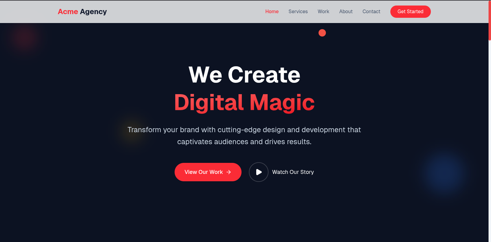
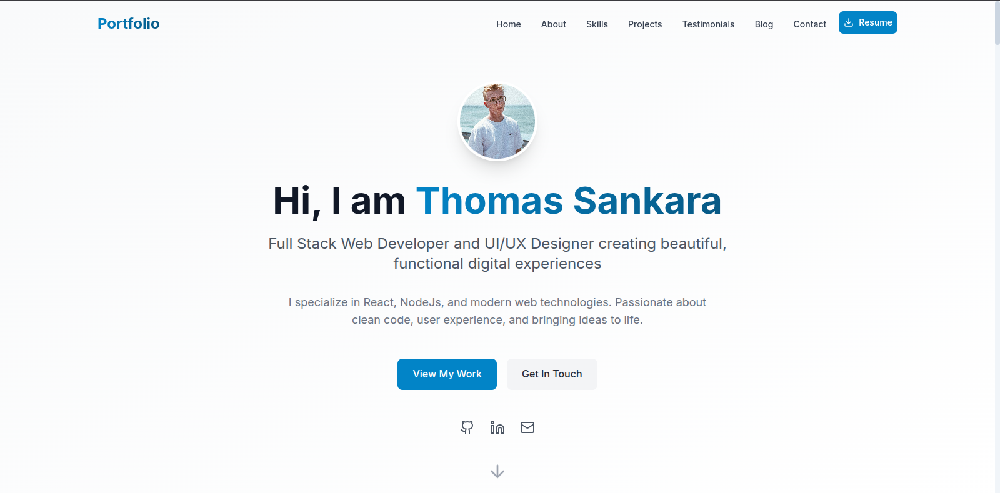
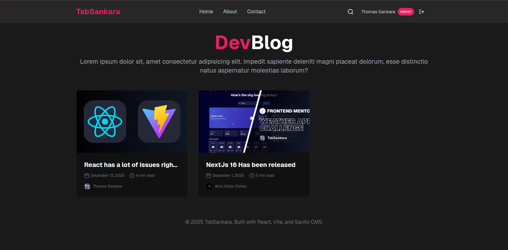

# React Vite Course Files

This repository is the home of all the code that we write in the react vite course.

## What we will build

### 1. An agency website

A pretty nice agency website.

### 2. A portfolio website

A slick portfolio website. No further explanation needed.

### 3. A personal blog

For the third project, we are going to build a personal blog using the Sanity CMS, which you can even turn to be your personal portfolio. What you will realize with many developers is that they will often have a blog linked on their personal website. This helps to retain information better because you have to write it in a way to help many people understand, and it also acts as a reference for you.

> This will be the longest project by far.

#### Features

1. Integration with the Sanity CMS
2. List all blogposts
3. Read blog posts
4. Add comments on blog posts

> We are going to be doing everything from scratch. So get ready to type...a lot.

### How to run
1. Clone or download the repository:

`git clone https://github.com/sankthomas/react-vite-course`

2. Open the folder in your favorite code editor.

3. Navigate into the project you want, for example:

`cd 1-agency-website`

4. Install dependencies using your package manager:

`npm i` or `pnpm i` or `yarn add`

5. Run your dev server:

`npm run dev` or `pnpm dev` or `yarn dev`
